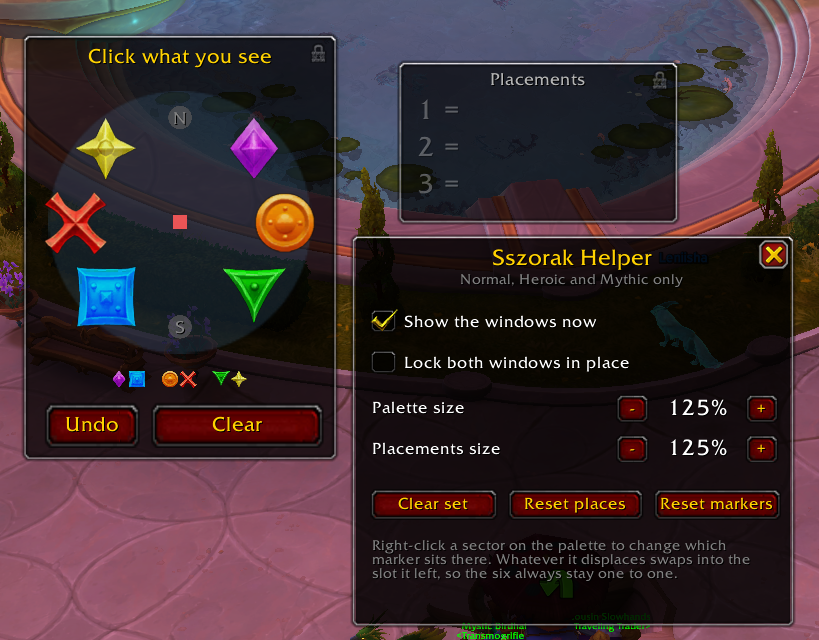

# Sszorak Map Helper

A small helper for **Sszorak** in Venomous Abyss. The fight asks you to place
something opposite something you can see. This addon helps with that... so you
don't swing your camera around wildly while trying to figure it out, bathing in
tornadoes while you wonder where on earth you even are.

## Commands

| | |
| --- | --- |
| `/sszmap` | open the options |

## Using it

- Pre-place the markers in the raid as they appear in the `/sszmap` preview.
- See a tornado? Click the icon that matches what you see! You can click them in
  order if you like, clicking the 1 tornado icon first, then the one with 2
  tornadoes, and so on.
- The **Placements** window lists them in call order, `1 = Star`, `2 = Triangle`,
  big enough to read without looking away from the fight.
- **Undo** drops the last one, **Clear** restarts the set. It also clears itself
  at the start and end of every pull.

## Licence

MIT. Do what you like with it. See [LICENSE](LICENSE) for the full text.
